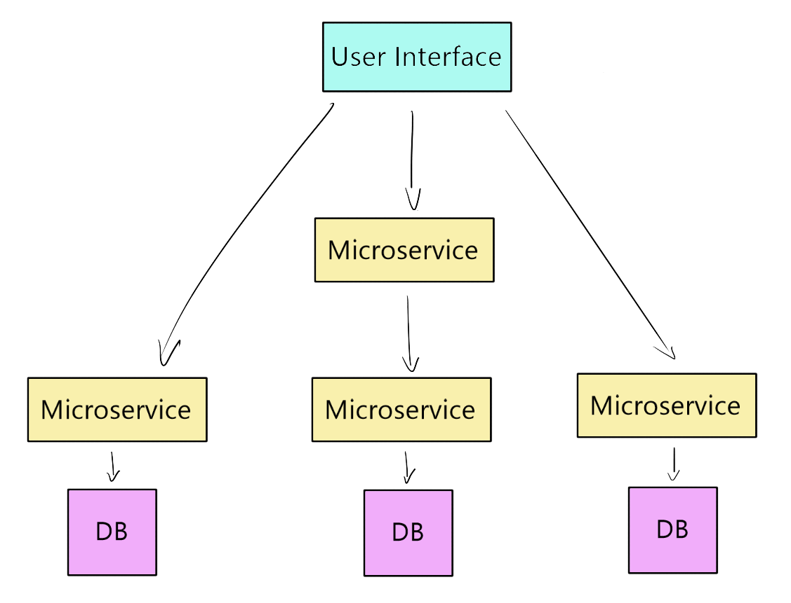

# Docker

## What is Docker
- a containerisation platform
- it works with any OS
- it creates container images, which contain all the information needed to create a self-contained application: code, settings, tools
- when an image is run it becomes a container, and the defined code can run
- multiple containers can be created from the same image


## Difference between Docker and VM
- Docker is smaller, faster, and more easily integrated with other systems

## Docker Installation and Setup
- https://docs.docker.com/engine/install/
- download the installer for your OS and run it
- you will need to restart your PC to complete the installation
- open git bash as admin and use `docker --version` to check it has installed
- run `docker run hello-world` to check it is working properly

## Docker Hub Account and Repo
- creating a docker hub account allows you to save container images
- other people can also see these images and use them
- repos allow you to organise your saved images

## Building Customised Images
- Dockerfiles can be created to save all the information needed to create an image and automate creation
- customised images can also be created by editing another image and committing and pushing to Docker hub to store it

## Microservices
- microservices involves the breakup of monolithic architecture into a number of independent services
- this means that large and complex applications can be more reliably delivered
- each individual part can be deployed, maintained, and tested on its own
- the parts communicate to allow the user to access the full application



## Docker Commands
- `docker --version`
- `docker run hello-world` runs a basic container, which confirms docker is working correctly
- `docker pull name_of_image`
- `docker run name_of_image`
- delete image `docker rmi name_of_image`
- `docker rmi name_of_image -f` to force
- `docker ps` check running images
- `$ docker cp filename container_id:file_path` copies a file from local machine into a container
- `docker exec -it 8441b5e71e08 sh` allows us to enter the container

### Task
- we created an nginx container with `docker run nginx`
- we then copied an HTML file into it to replace the default nginx page
- `$ docker cp index.html 8441b5e71e08:/usr/share/nginx/html/index.html`
- commit the new image with `docker commit container_id dockerhub_username/repo:tag`
- push the image to dockerhub with `docker push dockerhub_username/repo`

## Automate build steps
- we use a Dockerfile with a set of instructions
- naming convention to create Dockerfile is `Dockerfile`
```
FROM nginx

LABEL MAINTAINER = isobelfc

COPY app1 /usr/share/nginx/html

EXPOSE 80

CMD ["nginx", "-g", "daemon off;"]
```
- keywords in our Dockerfile need to be in all caps
- `FROM` allows us to use the official nginx image as our base image
- `LABEL MAINTAINER` gives the name of the creator, and is optional but is good practice
- `COPY` copies our `app1` directory into the given address
- `EXPOSE` exposes the required port for the base image
- `CMD` will execute the command as it's available in the official image

## Docker documentation
- `docker run -d -p 4000:4000 docs/docker.github.io`
- loading port 4000 will now bring up all we need to know about docker

## Kubernetes
- Kubernetes, or K8, allows automated deployment, scaling, and management of containerisation
- it groups together different containers that are a part of a single application

### Benefits of Kubernetes
- allows automatic deployment or rollback
- can restart or replace containers which fail health-checks
- can employ load balancing and scaling to maintain stability under heavy traffic
- allows the use of a DNS name or IP address to allow internet access, or access from other containers
